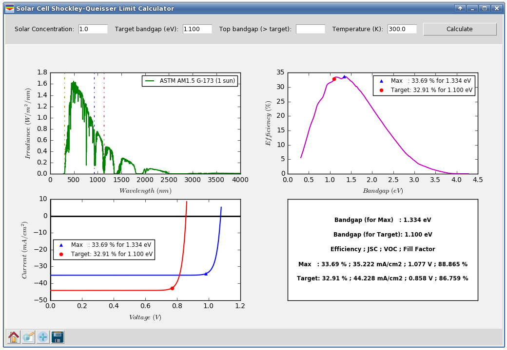
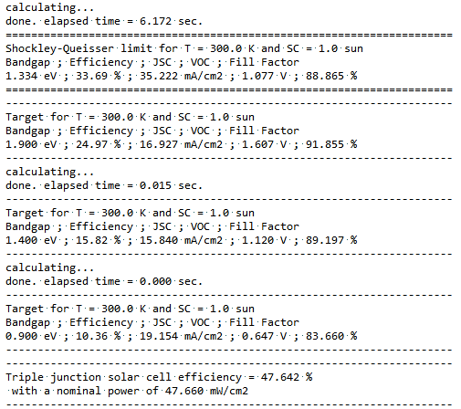
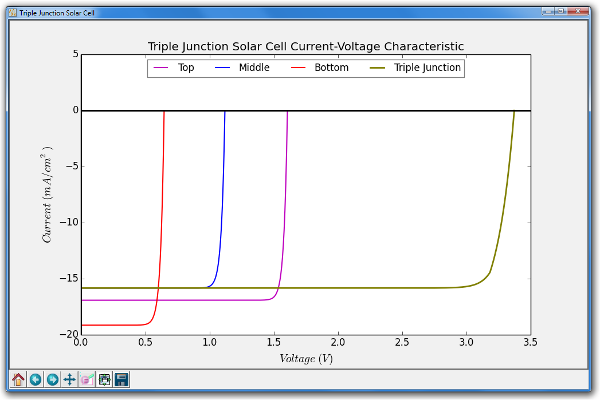
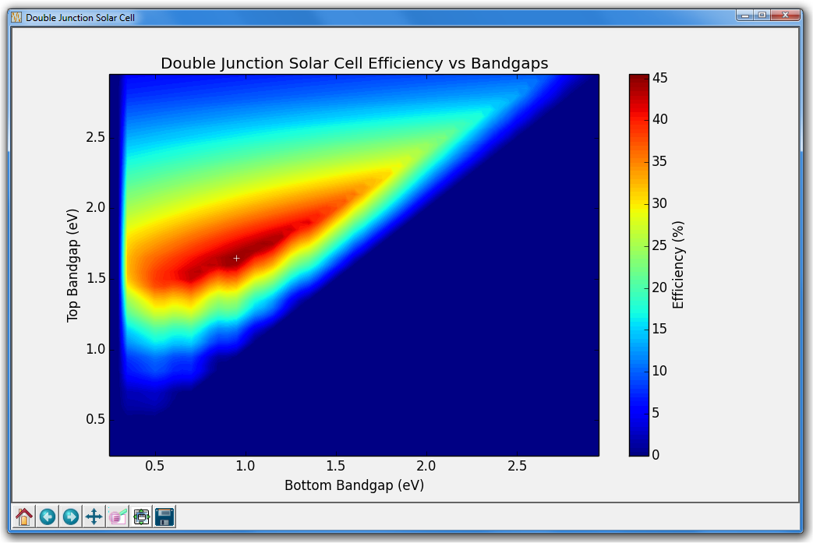

# Solar Cell Shockley-Queisser Limit Calculator

Code written by:  
Sidi Hamady  
Dr. habil. Eng., Associate professor  
Université de Lorraine, France  
sidi.hamady@univ-lorraine.fr

See Copyright Notice in COPYRIGHT

## Presentation and Requirements

The Shockley-Queisser limit is the maximum photovoltaic efficiency obtained for a solar cell with respect to the absorber bandgap.  
The theory is described by W. Shockley and H. J. Queisser in Journal of Applied Physics 32 (1961).

To install the Shockley-Queisser limit calculator:  
just download it:  
from github: [https://github.com/sidihamady/Shockley-Queisser](https://github.com/sidihamady/Shockley-Queisser)  
or from my website: [http://www.hamady.org/photovoltaics/ShockleyQueisser.zip](http://www.hamady.org/photovoltaics/ShockleyQueisser.zip)  
unzip and use.

The distribution mainly includes:  

Two main Python files:  
* [ShockleyQueisserCore.py](ShockleyQueisserCore.py) implementing the calculator core functionality in the module classes, with a simple and easy-to-use graphical user interface.  
* [ShockleyQueisser.py](ShockleyQueisser.py) implementing the program interface.  


Two text files:  
* [SolarSpectrum_AM15G.txt](SolarSpectrum_AM15G.txt) containing the standard AM1.5 solar spectrum.  
* [ShockleyQueisserCurve.txt](ShockleyQueisserCurve.txt) containing the Shockley-Queisser Efficiency vs Bandgap data.  


Two figures:  
* [ShockleyQueisserCurve.pdf](ShockleyQueisserCurve.pdf) containing the Shockley-Queisser Efficiency vs Bandgap curve in PDF format (to integrate for example in LaTeX document).  
* [ShockleyQueisserCurve.png](ShockleyQueisserCurve.png) containing the Shockley-Queisser Efficiency vs Bandgap curve in PNG format.  


Two examples on how to use the program to calculate multijunction solar cell efficiency:  
* [ShockleyQueisserTJ.py](ShockleyQueisserTJ.py) for triple solar cell junction.  
* [ShockleyQueisserDJ.py](ShockleyQueisserDJ.py) for double solar cell junction.  


It is not necessary to know the Python language to use the program.

The basic requirements are found in any Linux distribution (and easily installed for Windows):
* Python version 2.7.x or later
* numpy version 1.5 or later
* scipy version 0.13.1 or later
* matplotlib version 1.3.x or later
* tkinter 8.5 or later

PS: for Windows, you can download a complete Python distribution from [https://www.anaconda.com/distribution/](https://www.anaconda.com/distribution/)

## HowTo

Start [ShockleyQueisser.py](ShockleyQueisser.py) interface:  

from the command line prompt:  
under Linux:
```
cd /path/to/ShockleyQueisser/  
python -u ShockleyQueisser.py  
```
under Windows (in the command prompt):
```
cd C:\path\to\ShockleyQueisser\  
python.exe -u ShockleyQueisser.py  
```
You have to add python to your PATH.  

You can also execute [ShockleyQueisser.py](ShockleyQueisser.py) by double clicking on it (depending on the operating system settings), or from within your editor, if possible.

In the graphical interface, change the parameters you want (solar concentration, temperature and target bandgap) and press 'Calculate'.

Screenshot under Windows:  


Screenshot under Linux:  


## HowTo: Multijunction solar cell

The program calculates the efficiency for a single junction solar cell but takes into account the part of solar spectrum already absorbed (for example in a top cell) through the Target top bandgap parameter.
This is useful to calculate the overall efficiency in a multijunction solar cell.
For example for double junction solar cell, follow the steps below:  
1. set TargetBandgap to 1.65 eV and the TargetBandgapTop to 0, and calculate the corresponding efficiency and current-voltage characteristic.  
2. set TargetBandgap to 0.95 eV and the TargetBandgapTop to 1.65, and calculate the corresponding efficiency and current-voltage characteristic.  
Deduce from the previous data the overall double junction solar cell efficiency.  

Two examples are given below (for double and triple junction solar cells).

## HowTo: Command-line only mode

The calculator can be used in graphical (GUI) mode or command-line only mode. In command-line mode the results are printed out and saved in text files.

The command-line mode is useful to perform specific calculations such as multijunction solar cell efficiency.

Two examples are given in the included [ShockleyQueisserTJ.py](ShockleyQueisserTJ.py) and [ShockleyQueisserDJ.py](ShockleyQueisserDJ.py) files.  
The execution of [ShockleyQueisserTJ.py](ShockleyQueisserTJ.py) gives the following output:





The execution of [ShockleyQueisserDJ.py](ShockleyQueisserDJ.py) gives the following output (Efficiency of a double junction solar cell with respect to the top and bottom bandgap):


